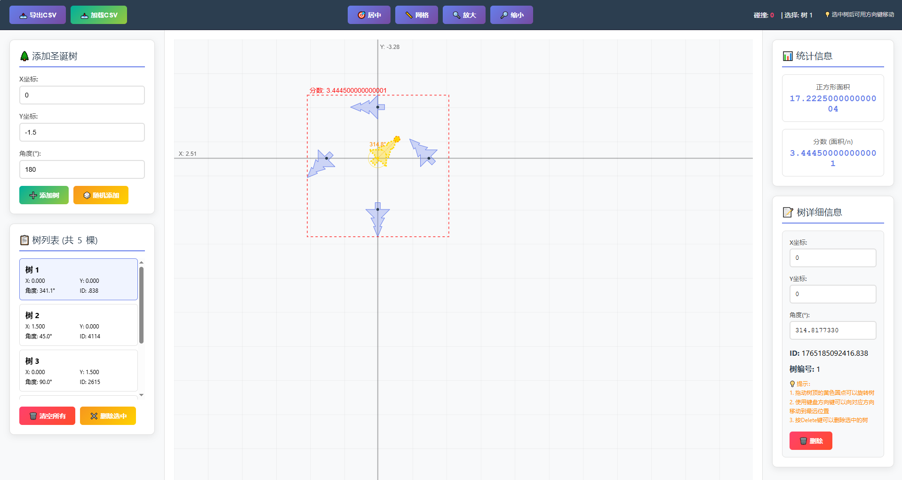

# 🌲 Christmas Tree Arrangement Editor


## 🎯 What is this?
A **visualization tool** that lets you arrange Christmas trees in a square. **Lower scores are better!**

## ✨ Core Features
- **Drag & Rotate**: Intuitively adjust tree positions and angles
- **Auto-Scoring**: Real-time compactness calculation
- **Collision Detection**: Shows tree overlaps
- **Arrow Key Movement**: Push trees to farthest position with one key

## 🚀 Get Started in 3 Steps
1. **Add Trees** → 2. **Adjust Positions** → 3. **Lower Your Score**

## 📊 Scoring Rules
```
Score = Bounding Square Area ÷ Number of Trees
```
**Goal: Make this number as small as possible!**

## 💡 Tips & Tricks
- Use **arrow keys** to quickly push trees apart
- Watch the size of the **red dashed box**
- Avoid tree overlaps

---

**Ready to use, no installation needed. Start challenging for your lowest score!** 🎄